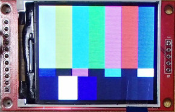
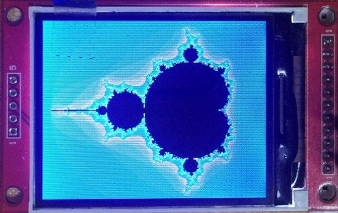
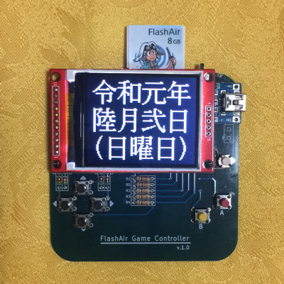

# FlashAir-SlibILI9225

Lua library for TFT display modules with ILI9225 for FlashAir.  
  
`Update at 2019/06/02`  
`TYPE2 PIO support.`  
`TYPE4 SPI support.`  
`init() and locate() comand format change.`  
`Japanese font and inter-character space and line interval support.`  

## Tested equipment

Tested on this 2.2-inch TFT display module with ILI9225 and FlashAir W-04 v4.00.03.  

   

## FlashAir to TFT module connections

Please choose your favorite type.

### Rename table

this text | module pin
--- | ---
CLK| CLK or SCK or SCL
SDI| SDI or SDA
DC | RS  or A0  or DC
CS | CS
RESET|RST or RESET or RES
LED| LED or LEDA  or BLK
GND| GND 
VCC| VCC
 
### TYPE list

FlashAir|TYPE1|TYPE2|TYPE3|TYPE4
--- | --- | --- | --- | ---
---  |w/Reset|w/PIO|w/LED|w/SPI
CMD  |SDI |SDI |SDI |SDI/DO 
DAT0 |CLK |CLK |CLK |CLK/CLK
DAT1 |DC  |DC  |DC  |DC /-- 
DAT2 |CS  |CS  |CS  |CS /DI 
DAT3 |RESET|PIO |LED |-- /CS 

### TYPE1  
Module Reset is hardware reset.  

FlashAir(Pin#) |ILI9225 TFT | Power | comment  
---     |--- |--- | ---
CLK (5) |--- |Pull-down(10korm) to GND
CMD (2) |SDI |
DAT0(7) |CLK |
DAT1(8) |DC  |
DAT2(9) |CS  |
DAT3(1) |RESET|
---     |LED |3.3V|
VCC (4) |VCC |3.3V   
VSS(3,6)|GND |GND    

### TYPE2  
DAT3 of FlashAir can be used for PIO.  

FlashAir(Pin#) |ILI9225 TFT| Power | comment
 ---    |--- |--- | ---
CLK (5) |--- |Pull-down(10korm) to GND
CMD (2) |SDI |
DAT0(7) |CLK |
DAT1(8) |DC  |
DAT2(9) |CS  |
DAT3(1) |PIO |
---     |RESET|Pull-up(10korm) to 3.3V
---     |LED |3.3V
VCC (4) |VCC |3.3V   
VSS(3,6)|GND |GND    

### TYPE3  
DAT3 of FlashAir for LED backlight on/off control.  

FlashAir(Pin#) |ILI9225 TFT | Power | comment
 ---    |--- | --- | ---
CLK (5) |--- |Pull-down(10korm) to GND
CMD (2) |SDI |
DAT0(7) |CLK |
DAT1(8) |DC  |
DAT2(9) |CS  |
DAT3(1) |LED ||connect through 10kohm
---     |RESET|Pull-up(10korm) to 3.3V
VCC (4) |VCC |3.3V
VSS(3,6)|GND |GND

### TYPE4  
CMD,DAT0,DAT2,DAT3 can be used for SPI.

FlashAir(Pin#) |ILI9225 TFT | Power | comment
--- | --- | --- | --- 
CLK (5) |--- |---| Pull-down(10korm) to GND
CMD (2) |SDI |DO |
DAT0(7) |CLK |CLK|
DAT1(8) |DC  |---|
DAT2(9) |CS  |DI | Pull-up(10korm) to 3.3V
DAT3(1) |--- |CS |
---     |RESET|---| Pull-up(10korm) to 3.3V
---     |LED |---| 3.3V
VCC (4) |VCC |VCC| 3.3V
VSS(3,6)|GND |GND| GND

## Install

SlibILI9225.lua -- Copy to somewhere in Lua's search path.

## Color format of functions

color   : BBBBB_GGGGGG_RRRRR (64K(16bpp) color)  
bgcolor : BBBBB_GGGGGG_RRRRR (64K(16bpp) back ground color)

## Internal bitmap data format

    -- same as FlashAir-SlibBMP.lua
    bitmap  = {}  
    bitmap.header -- copyed from BMP header  
    bitmap.width  -- bitmap width  
    bitmap.height -- bitmap height  
    bitmap.bit    -- bpp, 24 or 16(BBBBB_GGGGGG_RRRRR format)
    bitmap.flat   -- 1:Flat(Stuffing without leaving spaces for small image), 0:Stored in an array for each line.  
    bitmap.data   -- bitmap data  

## Internal font data format

    -- example --
    font74 = {
    height= 7;
    width = 4;
    [' '] ={0x00,0x00,0x00,0x00};
    ['!'] ={0x00,0x2F,0x00,0x00};
    ['"'] ={0x03,0x00,0x03,0x00};
    --
    ['~'] ={0x0C,0x04,0x06,0x00};
    }

## Usage
### sample of init()

command | description
--- | ---
ILI9225:init(type,rotate,xSize,ySize,rOffset,dOffset) | Parameter initialization and reset LCD module. **type:** 1:D3=RST,  2:D3=PIO, 3:D3=LED, 4:with SPI   See module connections information. **rotate:** 0:Vertical default, 1:Horizontal default, 2:Vertical reverse, 3:Horizontal reverse **xSize,ySize:** LCD x size, y size **rOffset,dOffset:** RAM address offset,default is 0,0
ILI9225:writeStart() | Enable control. (CS=0)
ILI9225:writeEnd()   | Disable control. (CS=1)
ILI9225:cls()        | Clear screen.
ILI9225:dspOn()      | Display contents of RAM.
ILI9225:dspOff()     | Do not display contents of RAM.
ILI9225:pset(x,y,color) | Plot point at (x,y). If color is omitted, fgcolor is used.
ILI9225:line(x1,y1,x2,y2,color) | Plot line (x1,y1)-(x2,y2). If color is omitted, fgcolor is used.
ILI9225:box(x1,y1,x2,y2,color) | Plot box (x1,y1)-(x2,y2). If color is omitted, fgcolor is used.
ILI9225:boxFill(x1,y1,x2,y2,color) | Plot filled box (x1,y1)-(x2,y2). If color is omitted, fgcolor is used.
ILI9225:circle(x,y,xr,yr,color) | Plot circle of center(x,y), radius(xr,yr). If color is omitted, fgcolor is used.
ILI9225:circleFill(x,y,xr,yr,color) | Plot filled circle of center(x,y), radius(xr,yr). If color is omitted, fgcolor is used.
ILI9225:put(x,y,bitmap) | Put 16 or 24bpp bitmap at upper left coordinates with (x,y).
ILI9225:put2(x,y,bitmap)| Put 16bpp flat bitmap faster at upper left coordinates with (x,y).
ILI9225:color(fgcolor,bgcolor) | Default color setting.
ILI9225:locate(x,y,mag,xsapce,yspace) | Locate cursor, set print area(x,y)-(xSize-1,ySize-1).**mag:** Text magnification. default is 1. **xspace:** Inter-character space. default is 0. **yspace:** line interval. default is 0.  If you do not want to change any arguments you can substitute nil.
ILI9225:setFont(font) | Set font table or return value of SlibJfont.lua.
x,y,n,rows=ILI9225:print(str) | Print alphabets and return next cursor position. Output will be stopped if the drawing range is exceeded. **n:** Number of characters output. **rows:** Number of lines output.
x,y,n,rows=ILI9225:println(str) | Print alphabets, creates a new line and return next cursor position. Output will be stopped if the drawing range is exceeded. **n:** Number of characters output. **rows:** Number of lines output.
ret=ILI9225:pio(ctrl,data) | Pio control of DAT3 at type2. If type1 then return nil. ctrl is 0:input, 1:output. data is value for output and return input value.  Default is input.
ILI9225:ledOn() | LED backlight ON at TYPE3.
ILI9225:ledOff() | LED backlight OFF at TYPE3.
ret=ILI9225:pio(ctrl,data) | PIO control of DAT3 at TYPE2. PIO default is input. **ctrl:** 0:input, 1:output. data: value for output **return:** input value or nil at TYPE1
ILI9225:spiInit(period,mode,bit,cstype)|SPI init for TYPE4. **period,mode,bit:** same as fa.spi(...) **cstype:** 0:low enable, 1:high enable, 2:always High-Z
res = ILI9225:spiWrite(data_num) res = ILI9225:spiWrite(data_str,xfer_num)|SPI write for TYPE4. **data_num,data_str,xfer_num,res:** same as fa.spi("write", ...)
res_num = ILI9225:spiRead() res_tbl = ILI9225:spiRead(xfer_num,data_num)|SPI read for TYPE4. **xfer_num,data_num,res_num,res_tbl:** same as fa.spi("read", ...)

## Sample program

 

>sample.lua      `-- draw graphics demo`  
>sample_kanji.lua `-- Kanji character support demo`  
>mandelbrot.lua  `-- draw Mandelbrot set`  
>lib/SlibILI9225.lua  
>lib/SlibBMP.lua `-- Copy from FlashAir-SlibBMP repository`  
>img/balloon01.bmp  
>font/font74.lua  

These files copy to somewhere in FlashAir.

If you want to run "sample_kanji.lua", please prepare the following.  

### 日本語フォントを使う方法

日本語フォントを使う場合は、下記のレポジトリをご参照ください。  
https://github.com/AoiSaya/FlashAir_SlibJfont  

例として、"sample_kanji.lua"を実行する手順を以下に示します。  
上記レポジトリから以下のファイルを入手してFlashAirに保存します。  

    lib/SlibJfont.lua  -- ライブラリ  
    lib/Utf8Euc_jp.tbl -- UTF-8をEUC-JPに変換する際の変換テーブル  
    font/bdf2sef.lua   -- ファイル形式変換プログラム  

### サンプル用フォントの入手
[文字情報サービス環境 CHISE](http://www.chise.org/dist/fonts/BDF/JISX0213/)から  
jiskan24-2003-1.bdf.gz をダウンロードして解凍し、下記ファイルをfont/ の下に置きます。  
    jiskan24-2003-1.bdf  
    12x24rk.bdf  

次に bdf2sef.lua を編集して、末尾に  

    convBdf2Bin("jiskan24-2003-1.bdf")  
    convBdf2Bin("k12x24rk.bdf")  
    
を追加してください。  
bdf2sef.lua を実行すると、font/ の下に"jiskan24-2003-1.sef" と "k12x24rk.sef" が生成されます。  
この状態で "sample_kanji.lua" を実行すると、LCD上に日本語が表示されます。  

## Licence

[MIT](/LICENSE)

## Author

[GitHub/AoiSaya](https://github.com/AoiSaya)  
[Twitter ID @La_zlo](https://twitter.com/La_zlo)
