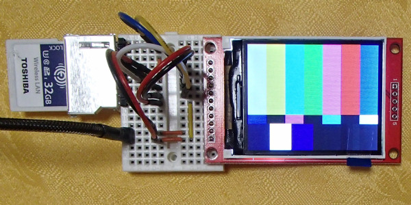

# FlashAir-SlibILI9225

Lua library for TFT display modules with ILI9225 for FlashAir.  
  

## Tested equipment

Tested on this 2.2-inch TFT display module with ILI9225 and FlashAir W-04 v4.00.03.

 

## FlashAir to TFT module connections

**Type1**  
Module Reset is hard reset.  

ILI9225 TFT | FlashAir(Pin#) | Power
--- | --- | ---
--- |CLK (5) |Pull-down(10korm) to GND
SDI |CMD (2) |
CLK |DAT0(7) |
RS  |DAT1(8) |
CS  |DAT2(9) |
RST |DAT3(1) |
LED |---     |3.3V
VCC |VCC (4) |3.3V   
GND |VSS(3,6)|GND    

**Type2**
Module reset is only a soft reset.  
DAT3 for FlashAir can be used for another purpose.  

ILI9225 TFT | FlashAir(Pin#) | Power
--- | --- | ---
--- |CLK (5) |Pull-down(10korm) to GND
SDI |CMD (2) |
CLK |DAT0(7) |
RS  |DAT1(8) |
CS  |DAT2(9) |
--- |DAT3(1) |
RST |---     |Pull-up(10korm) to 3.3V
LED |---     |3.3V
VCC |VCC (4) |3.3V   
GND |VSS(3,6)|GND    

## Install

SlibILI9225.lua -- Copy to somewhere in Lua's search path.

## Color format of functions

color   : BBBBB_GGGGGG_RRRRR (64K(16bpp) color)  
bgcolor : BBBBB_GGGGGG_RRRRR (64K(16bpp) back ground color)

## Internal bitmap data format

    -- same as FlashAir-SlibBMP.lua
    bitmap  = {}  
    bitmap.header -- copyed from BMP header  
    bitmap.width  -- bitmap width  
    bitmap.height -- bitmap height  
    bitmap.bit    -- bpp, 24 or 16(BBBBB_GGGGGG_RRRRR format)
    bitmap.flat   -- 1:Flat(Stuffing without leaving spaces for small image), 0:Stored in an array for each line.  
    bitmap.data   -- bitmap data  

## Internal font data format

    -- example --
    font74 = {
    height= 7;
    width = 4;
    [' '] ={0x00,0x00,0x00,0x00};
    ['!'] ={0x00,0x2F,0x00,0x00};
    ['"'] ={0x03,0x00,0x03,0x00};
    --
    ['~'] ={0x0C,0x04,0x06,0x00};
    }

## Usage
### sample of init()

command | description
--- | ---
ILI9225:init(type,rotate,xSize,ySize,offset) | Parameter initialization and reset LCD module. type: 1:D3=RST=H/L, 2:D3=Hi-Z(no hard reset) rotate: 0:Vertical default, 1:Horizontal default, 2:Vertical reverse, 3:Horizontal reverse xSize:LCD x size, ySize:LCD y size, offset:RAM address offset
ILI9225:setup() | Setup LCD module.
ILI9225:writeStart() | Enable control. (CS=0)
ILI9225:writeEnd()   | Disable control. (CS=1)
ILI9225:cls()        | Clear screen.
ILI9225:dspOn()      | Display contents of RAM.
ILI9225:dspOff()     | Do not display contents of RAM.
ILI9225:pset(x,y,color) | Plot point at (x,y).
ILI9225:line(x1,y1,x2,y2,color) | Plot line (x1,y1)-(x2,y2).
ILI9225:box(x1,y1,x2,y2,color) | Plot box (x1,y1)-(x2,y2).
ILI9225:boxFill(x1,y1,x2,y2,color) | Plot filled box (x1,y1)-(x2,y2).
ILI9225:circle(x,y,xr,yr,color) | Plot circle of center(x,y), radius(xr,yr).
ILI9225:circleFill(x,y,xr,yr,color) | Plot filled circle of center(x,y), radius(xr,yr).
ILI9225:put(bitmap,x,y) | Put 16 or 24bpp bitmap at upper left coordinates with (x,y).
ILI9225:put2(bitmap,x,y)| Put 16bpp flat bitmap faster at upper left coordinates with (x,y).
ILI9225:locate(x,y,mag,color,bgcolor,font) | Locate cursor, set print area(x,y)-(xSize-1,ySize-1), attributions and font. If you do not want to change any arguments you can substitute nil.
x,y=ILI9225:print(str) | Print alphabets and return next cursor position.
x,y=ILI9225:println(str) | Print alphabets, creates a new line and same as above.

## Sample program

>sample.lua  
>lib/SlibILI9225.lua  
>lib/SlibBMP.lua `-- Copy from FlashAir-SlibBMP repository`  
>img/balloon01.bmp  
>font/font74.lua  

These files copy to somewhere in FlashAir.

## Licence

[MIT](https://github.com/AoiSaya/FlashAir-libBMP/blob/master/LICENSE)

## Author

[GitHub/AoiSaya](https://github.com/AoiSaya)  
[Twitter ID @La_zlo](https://twitter.com/La_zlo)
r.com/La_zlo)
